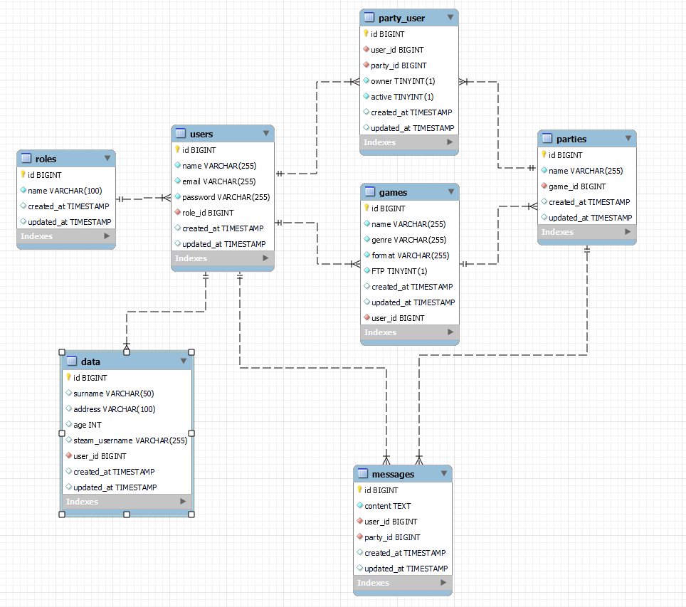

# Database and API REST for LFG App

## Description of the project

This project contains a database and API REST made in PHP with Laravel for a web app that allows players to search for groups for their favourite games and chat with other group members.

There is a JWT-based authentication, Admins can add games and delete players and players must be logged in for everything aside from looking at the full list of games available in the platform.

## Technologies used

## Database

The project includes a relational database made in SQL that allows players to belong to parties and be owners or active members of said parties and send editable messages to the party if they are active members of it.

The database is deployed in Railway.

## Instructions to use the API

You need to have PHP, Composer and Laravel installed.

Clone this repository and run

> composer install

Once all packages are installed, run

> php artisan serve

Now you have the server running and the database is remotely deployed, so you can start making petitions to the API!

Here's a Postman collection with every endpoint in the API for you to use.

## Endpoints available

1. AUTHENTICATION
    - Register user  
      Registers a user with name, email and password. Additional data can be provided later on.  
      The registration automatically assigns the role of 'User' to every new member.  
      The credentials for the Admin user are in the Postman collection.
    - Login  
      Login to the app with your email and password! A token will be provided, you will need to use it to make petitions to private endpoints.
    - Logout  
      This will invalidate your token.
    - Change password  
      This updates your password in the database and logs you out of the app.
2. USERS
    - See my profile  
      Here you can see all of your data.
    - See profile by ID  
      Searches a profile by their ID and shows their public data.
    - See all profiles (ADMIN ONLY)  
      Admin can see all registered users in the app.
    - Edit personal data (surname, address, age, steam username)  
      From here you can edit your personal data. You can edit as many fields as you want, and all of them are nullable.
    - Delete your own profile  
      You can delete your profile.
    - Delete users (ADMIN ONLY)  
      Admin can delete other users' profiles.
3. GAMES
    - Create game (ADMIN ONLY)  
      Admins can create new games for the platform, with the name of the game, its genre and if it is Free To Play or not.
    - Delete game (ADMIN ONLY)  
      Admins can also delete games from the platform.
    - See all games (No authentication needed)  
      Anyone can see every game available on the app.
    - Search game by ID (No authentication needed)  
      They can also search games by their ID...
    - Search game by name (No authentication needed)  
      Or their name. This is a dynamic search, the name doesn't need to be strictly equal to the one of the game in the database.
4. PARTIES
    - Create a party (GIVES OWNER STATUS)  
      When creating a party, the user doing so will receive owner status, meaning they will be able to delete the party afterwards and they cannot leave the party.
    - Join a party (GIVES ACTIVE STATUS)  
      Any user can join a new party, and they will then receive active status, which will be used to determine if they are still in the party and to allow them to use the messaging feature.
    - Leave a party (ERASES ACTIVE STATUS)  
      Any active user can leave a party anytime, and that will change their status to inactive. They can come back whenever they please!
    - Delete a party (OWNER ONLY)  
      The owner of a party can delete it at any time.
    - See the parties I'm in  
      All users can see which parties they are in.
5. MESSAGES (ONLY ACTIVE USERS) 
   - Send message  
   Users can send messages to their party...
   - Edit message  
    Edit them... 
    - Delete message  
    And delete them. Both of these functions check first if the user is active at the time and if the message is theirs. 
    - See all messages  
    All active users can see all the messages sent to their party.
